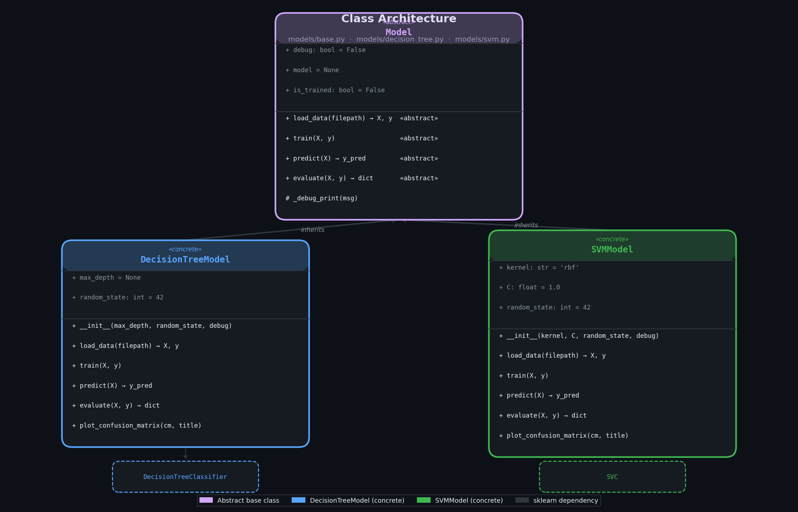
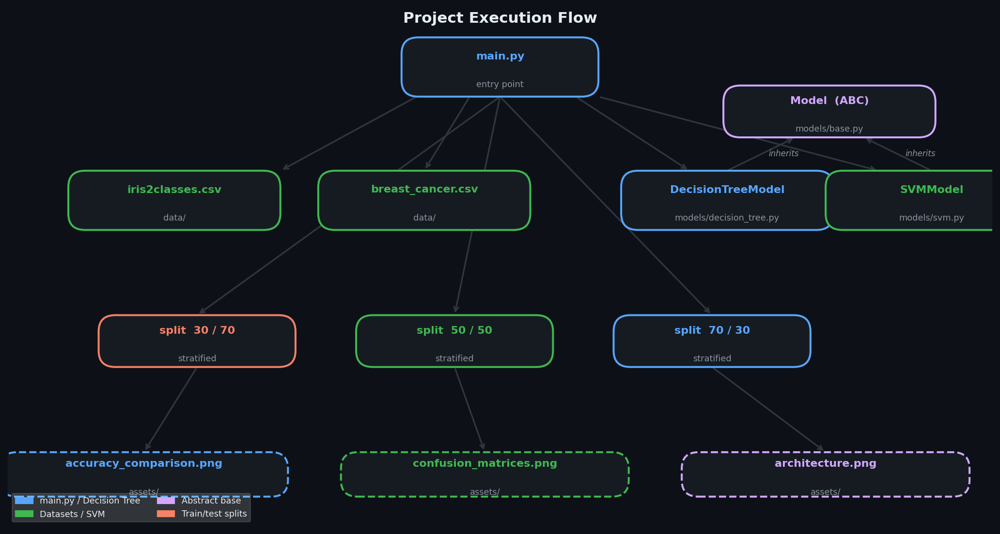
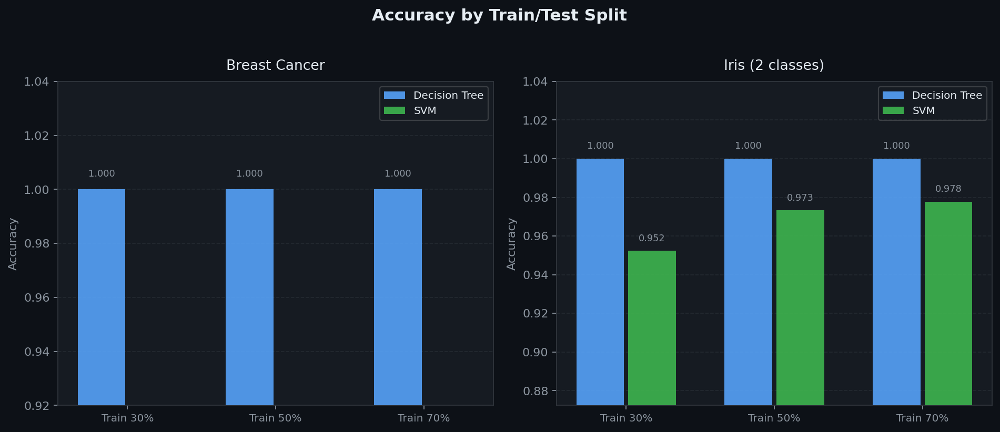
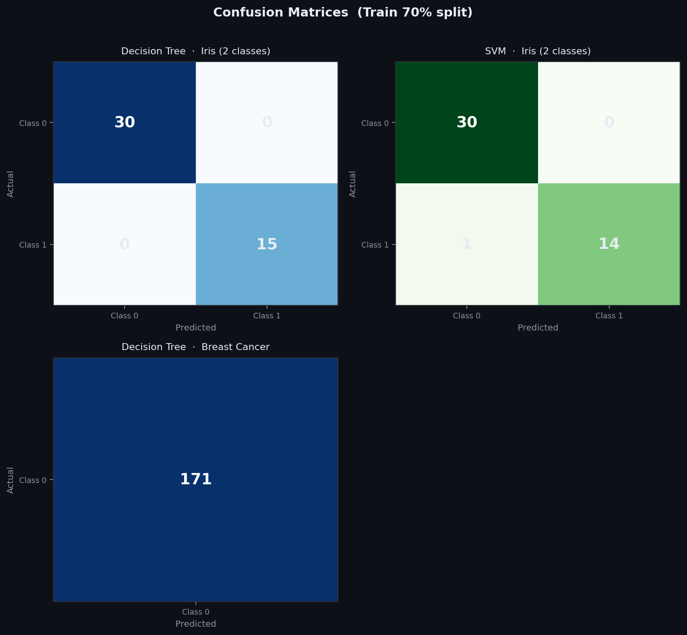

# 🤖 ML Classifier Comparison

> Compare **Decision Tree** and **SVM** classifiers across multiple datasets and train/test splits — clean OOP design, stratified sampling, automatic label encoding, and self-updating visual assets.



---

## 📋 Table of Contents

- [Overview](#overview)
- [Project Structure](#project-structure)
- [Class Architecture](#class-architecture)
- [Installation](#installation)
- [Datasets](#datasets)
- [Usage](#usage)
- [Output Format](#output-format)
- [Generated Assets](#generated-assets)
- [Debug Mode](#debug-mode)
- [Error Handling](#error-handling)
- [Extending the Project](#extending-the-project)

---

## Overview

This project runs a systematic benchmark of two classic ML classifiers:

| Classifier     | Implementation                        | Key Hyperparameters              |
|----------------|---------------------------------------|----------------------------------|
| Decision Tree  | `sklearn.tree.DecisionTreeClassifier` | `max_depth`, `random_state`      |
| SVM            | `sklearn.svm.SVC`                     | `kernel`, `C`, `random_state`    |

Each classifier is evaluated on **two datasets** using **three train/test splits** (30/70, 50/50, 70/30) with **stratified sampling** to preserve class balance.

Metrics reported per experiment: **accuracy**, **F1 score**, **confusion matrix**.

At the end of every run, `main.py` **overwrites** the visual assets in `assets/` with fresh plots built from the actual results — no stale images.

---

## Project Structure

```
ml_project/
├── main.py                 # Entry point — runs all experiments, then saves assets/
├── data/
│   ├── iris2classes.csv    # Iris dataset filtered to 2 classes
│   └── breast_cancer.csv   # Wisconsin Breast Cancer dataset
├── assets/                 # Auto-generated on every run (overwritten, not appended)
│   ├── architecture.png        ← UML class diagram
│   ├── class_hierarchy.png     ← project execution flow
│   ├── accuracy_comparison.png ← bar chart built from real results
│   └── confusion_matrices.png  ← grid of confusion matrices
└── models/
    ├── __init__.py
    ├── base.py             # Abstract base class: Model
    ├── decision_tree.py    # DecisionTreeModel
    └── svm.py              # SVMModel
```

---

## Class Architecture

The diagram below is the canonical reference — it is regenerated every time `main.py` runs.


### Execution flow



---

### `models/base.py` — Abstract Base Class

```python
from abc import ABC, abstractmethod

class Model(ABC):
    def __init__(self, debug=False):
        self.debug      = debug       # True → verbose output
        self.model      = None        # set by train()
        self.is_trained = False

    @abstractmethod
    def load_data(self, filepath): ...   # → X: np.ndarray, y: np.ndarray

    @abstractmethod
    def train(self, X, y): ...

    @abstractmethod
    def predict(self, X): ...            # → y_pred: np.ndarray

    @abstractmethod
    def evaluate(self, X, y): ...        # → dict

    def _debug_print(self, msg): ...     # prints only when self.debug is True
```

`evaluate()` always returns:
```python
{
    "accuracy":         float,
    "f1_score":         float,
    "confusion_matrix": np.ndarray   # shape (n_classes, n_classes)
}
```

---

### `models/decision_tree.py` — DecisionTreeModel

```python
class DecisionTreeModel(Model):
    def __init__(self, max_depth=None, random_state=42, debug=False)
```

| Method | Description |
|--------|-------------|
| `load_data(filepath)` | Reads CSV; drops NaN rows; **label-encodes every non-numeric column** (features and target); returns `X, y` |
| `train(X, y)` | Fits a `DecisionTreeClassifier` |
| `predict(X)` | Returns class predictions |
| `evaluate(X, y)` | Returns accuracy, weighted F1, confusion matrix |
| `plot_confusion_matrix(cm, title, save_path=None)` | Blues heatmap; saves to `save_path` if given, otherwise `plt.show()` |

---

### `models/svm.py` — SVMModel

```python
class SVMModel(Model):
    def __init__(self, kernel='rbf', C=1.0, random_state=42, debug=False)
```

| Method | Description |
|--------|-------------|
| `load_data(filepath)` | Same robust loading as `DecisionTreeModel` |
| `train(X, y)` | Fits an `SVC` (with `probability=True`) |
| `predict(X)` | Returns class predictions |
| `evaluate(X, y)` | Returns accuracy, weighted F1, confusion matrix |
| `plot_confusion_matrix(cm, title, save_path=None)` | Same as above but Greens colourmap |

---

## Installation

### Prerequisites

- Python 3.8+
- pip

### 1 · Clone

```bash
git clone https://github.com/your-username/ml_project.git
cd ml_project
```

### 2 · Virtual environment (recommended)

```bash
python -m venv venv
source venv/bin/activate        # macOS / Linux
venv\Scripts\activate           # Windows
```

### 3 · Install dependencies

```bash
pip install -r requirements.txt
```

**`requirements.txt`**
```
pandas>=1.3.0
scikit-learn>=1.0.0
matplotlib>=3.4.0
numpy>=1.21.0
```

---

## Datasets

| File | Classes | Features | Samples | Notes |
|------|---------|----------|---------|-------|
| `iris2classes.csv` | 2 (setosa, versicolor) | 4 | 100 | Last column = species |
| `breast_cancer.csv` | 2 (malignant, benign) | 30 | 569 | Last column = diagnosis |

**Any CSV works** as long as:
- First row is a header (pandas skips it automatically)
- Last column is the target/label
- String columns — in features *or* target — are label-encoded automatically

### Generating the bundled datasets

```python
import pandas as pd
from sklearn.datasets import load_iris, load_breast_cancer

# Iris 2 classes
iris = load_iris(as_frame=True)
df = iris.frame.copy()
df['species'] = iris.target_names[iris.target]
df = df[df['species'] != 'virginica']
df.to_csv('data/iris2classes.csv', index=False)

# Breast Cancer
bc = load_breast_cancer(as_frame=True)
df = bc.frame.copy()
df['diagnosis'] = bc.target_names[bc.target]
df.to_csv('data/breast_cancer.csv', index=False)
```

---

## Usage

### Run all experiments

```bash
python main.py
```

This will:
1. Load each dataset
2. Train both models across all three splits (18 experiments total)
3. Print results to stdout
4. **Overwrite** `assets/accuracy_comparison.png` and `assets/confusion_matrices.png` with fresh plots
5. **Overwrite** `assets/architecture.png` with the current UML class diagram

### Use a model standalone

```python
from models.decision_tree import DecisionTreeModel
from sklearn.model_selection import train_test_split

model = DecisionTreeModel(max_depth=5, debug=True)
X, y  = model.load_data('data/iris2classes.csv')

X_train, X_test, y_train, y_test = train_test_split(
    X, y, test_size=0.3, stratify=y, random_state=42
)

model.train(X_train, y_train)
results = model.evaluate(X_test, y_test)

# show interactively
model.plot_confusion_matrix(results['confusion_matrix'], 'Iris — DT')

# or save to file
model.plot_confusion_matrix(results['confusion_matrix'], 'Iris — DT',
                             save_path='assets/my_cm.png')
```

### Customise SVM kernel

```python
from models.svm import SVMModel

model = SVMModel(kernel='linear', C=0.5)
X, y  = model.load_data('data/breast_cancer.csv')
# ... same split / train / evaluate flow
```

---

## Output Format

```
============================================================
Dataset: Iris (2 classes) | Model: Decision Tree
Train: 30% | Test: 70%
============================================================
Training samples: 30 | Test samples: 70

Results:
  Accuracy: 0.9524
  F1 Score: 0.9523

Confusion Matrix:
[[53  2]
 [ 3 47]]
```

---

## Generated Assets

Every `python main.py` run **overwrites** these four files:

| File | Contents |
|------|----------|
| `assets/architecture.png` | UML class diagram (Model ABC → subclasses → sklearn) |
| `assets/class_hierarchy.png` | Project execution flow (main → data/models → splits → outputs) |
| `assets/accuracy_comparison.png` | Bar chart — accuracy per split / model / dataset |
| `assets/confusion_matrices.png` | Grid — best-split matrix per (model × dataset) |





---

## Debug Mode

```python
model = DecisionTreeModel(debug=True)
```

Sample output:
```
[DEBUG] Loaded data/iris2classes.csv, shape: (100, 5)
[DEBUG] Dropped 0 rows with missing values
[DEBUG] Label-encoded column 'species': {'setosa': 0, 'versicolor': 1}
[DEBUG] X shape: (100, 4), classes: [0 1]
[DEBUG] Model trained successfully
```

---

## Error Handling

The project never crashes — every method uses `try/except`:

| Scenario | Behaviour |
|----------|-----------|
| File not found | Warning printed, dataset skipped |
| Non-numeric feature column | Label-encoded automatically |
| Non-numeric target column | Label-encoded automatically |
| Missing values | Rows dropped silently (logged in debug mode) |
| `predict`/`evaluate` before `train` | Clear exception message returned |
| Plot failure | Logged via `_debug_print`, execution continues |

---

## Extending the Project

### Add a new classifier

1. Create `models/random_forest.py`, inherit from `Model`
2. Implement all four abstract methods + `plot_confusion_matrix`
3. Add a factory lambda to `model_configs` in `main.py`:

```python
model_configs = {
    "Decision Tree":  lambda: DecisionTreeModel(max_depth=5),
    "SVM":            lambda: SVMModel(kernel='rbf', C=1.0),
    "Random Forest":  lambda: RandomForestModel(n_estimators=100),  # ← add this
}
```

### Add a new dataset

Drop any CSV into `data/` and add the path to `datasets` in `main.py`:

```python
datasets = {
    "Iris (2 classes)": "data/iris2classes.csv",
    "Breast Cancer":    "data/breast_cancer.csv",
    "My Dataset":       "data/my_dataset.csv",   # ← add this
}
```

---

## License

MIT — see `LICENSE` for details.

---

<p align="center">Built with scikit-learn · matplotlib · pandas</p>